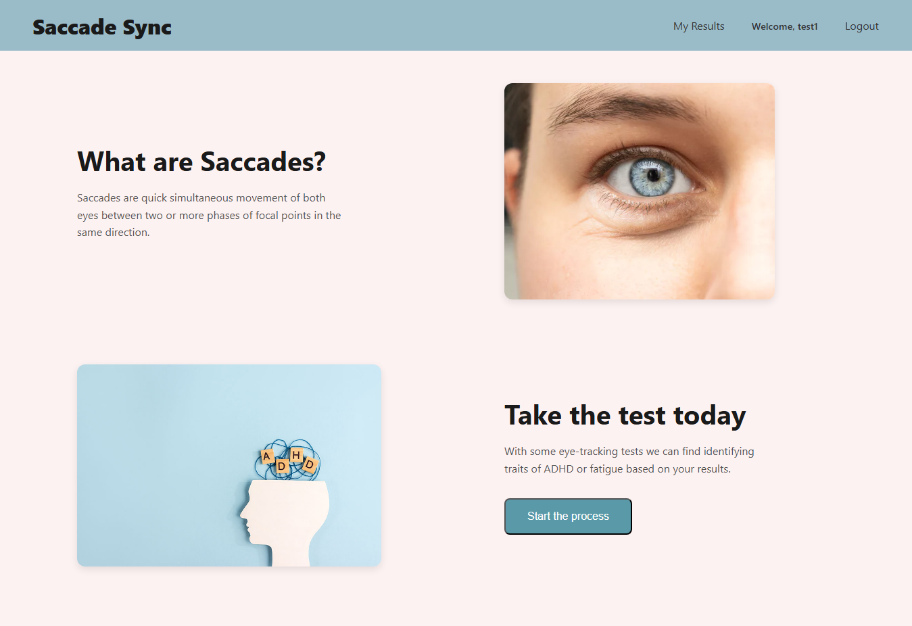
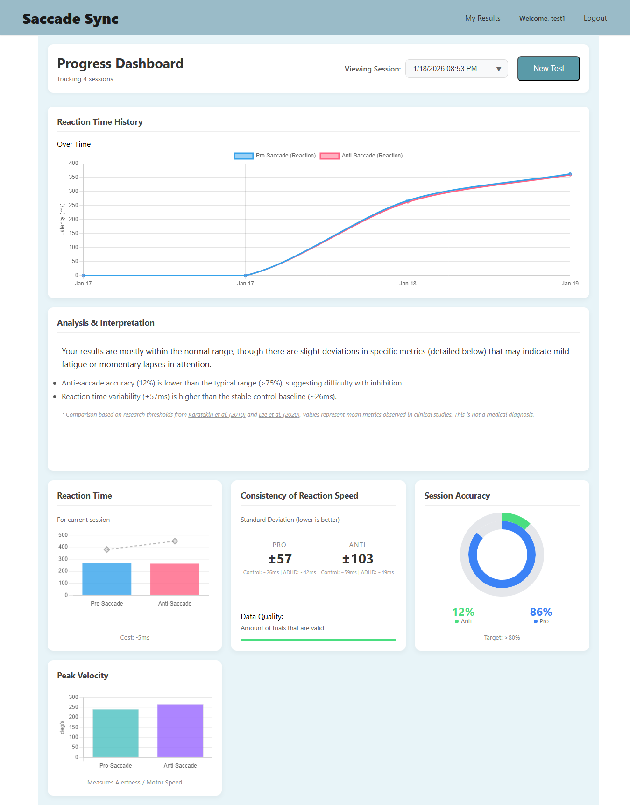
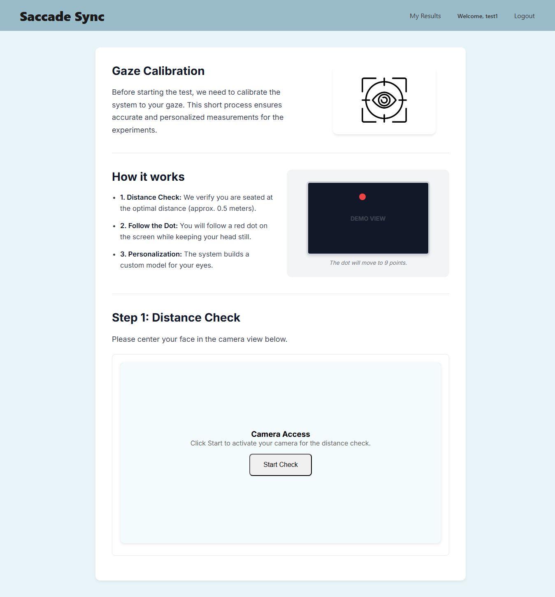

# SaccadeSync


> A web-based eye-tracking application for ADHD and fatigue screening through scientifically validated saccade tests.

[//]: # (![License]&#40;https://img.shields.io/badge/license-MIT-lightgrey&#41;)

## Screenshot

 <br>
 <br>

<table>
  <tr>
    <td></td>
    <td></td>
  </tr>
  <tr>
     <tr>
        <td style="text-align: center;"><b>Calibration</b></td>
        <td style="text-align: center;"><b>Instruction</b></td>
 </tr>
</table>

---

## What are Saccades?

Saccades are quick, simultaneous movements of both eyes between two or more points of focus
in the same direction. Research has shown that saccadic eye movement patterns can reveal
important information about cognitive function and attention.

## About the Project

**SaccadeSync** is a web-based eye-tracking application designed to identify potential traits of
ADHD (Attention Deficit Hyperactivity Disorder) or fatigue through scientifically validated saccade tests. The application uses your device’s webcam to track eye movements and analyze your
performance on visual attention tasks.

It implements two gold-standard neurological paradigms:
- **Pro-Saccade** – measures basic visual reaction speed
- **Anti-Saccade** – measures inhibitory control and executive function

Results are compared against research-based ADHD thresholds and stored persistently in the user's account via Firebase.

> **Medical Disclaimer:** SaccadeSync is a screening tool for informational purposes only. It does **not** constitute a medical diagnosis. Consult a qualified healthcare professional for proper assessment.

---

## Features

- **Live webcam feed** with real-time face detection and positioning feedback
- **9-point guided calibration** using Ridge Regression — retake if accuracy < 85%
- **Pro-Saccade & Anti-Saccade tests** — 10 trials each, randomized stimuli timing and position
- **Results dashboard** with velocity, latency, accuracy, and variability metrics
- **Historical timeline** — last 14 sessions visualized with Chart.js line graphs
- **Cross-device sync** via Firebase Authentication + Firestore
- **Privacy-first** — video never leaves your browser; only aggregated metrics are stored

---

## Tech Stack

| Layer               | Technology                                              |
|---------------------|---------------------------------------------------------|
| Language            | JavaScript                                              |
| Frontend            | React, HTML, CSS                                        |
| Computer Vision     | Google MediaPipe Web SDK (`@mediapipe/vision` v0.10.22) |
| Data Visualization  | Chart.js                                                |
| Backend / Auth / DB | Firebase (Serverless)                                   |
| State Management    | Redux                                                   |
| Testing             | Jest + React Testing Library                            |
| CI/CD               | GitHub Actions                                          |

---

##  Architecture

SaccadeSync uses a **Client-Serverless** architecture:

- **Client side (React + MediaPipe):** handles all eye-tracking logic, calibration, stimulus presentation, and gaze data processing locally in the browser.
- **Backend (Firebase):** provides serverless cloud functions for Authentication, Firestore database interactions, and cross-device data synchronization.

**Firestore Collections:**
```aiexclude
users/
└── {userId}/
├── calibrations/ # Per-user calibration session models
└── saccadeMetrics/ # Pro & Anti saccade test results
```


---

## Getting Started

### Prerequisites

- A modern web browser: **Google Chrome** or **Microsoft Edge** (Firefox is not fully supported)
- A working webcam — minimum **720p resolution**
- A well-lit environment
- Stable internet connection
- Seated approximately **0.5 meters (arm's length)** from your screen

### Installation

```bash
# Clone the repository
git clone https://github.com/your-username/saccadesync.git
cd saccadesync

# Install dependencies
npm install

# Start the development server
npm start
```

#### You will need to configure your own Firebase project. Create a .env file at the root with your Firebase credentials:
```text
REACT_APP_FIREBASE_API_KEY=your_key
REACT_APP_FIREBASE_AUTH_DOMAIN=your_domain
REACT_APP_FIREBASE_PROJECT_ID=your_project_id
REACT_APP_FIREBASE_STORAGE_BUCKET=your_bucket
REACT_APP_FIREBASE_MESSAGING_SENDER_ID=your_sender_id
REACT_APP_FIREBASE_APP_ID=your_app_id
```


### How to Use
- Create an account — optionally add medical background (medications, conditions, family history)
- Calibrate — follow the red dot across 9 screen positions; must reach ≥ 85% accuracy
- Take the Pro-Saccade test — look toward the white dot when it appears (10 trials)
- Take the Anti-Saccade test — look in the opposite direction of the white dot (10 trials)
- View your results — metrics are analyzed and compared against clinical baselines

### Tips for Best Accuracy
- Avoid backlighting (don't sit in front of a window)
- Keep your head still — move only your eyes
- Take tests when alert, not fatigued (unless testing for fatigue)
- Glasses may cause reflections; remove if possible
- Take tests at similar times of day for consistent comparison

